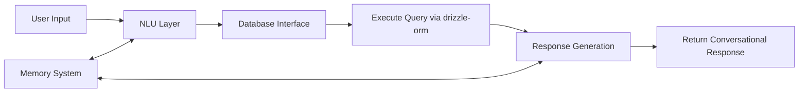

# Clinician Chatbot Implementation Plan

## Overview

This document outlines the plan for implementing a clinician-facing chatbot that allows clinicians to query our database using natural language. The chatbot will be built using LangChain as the primary framework with OpenAI's GPT models as the underlying LLM. It will connect securely to our database with read-only permissions through drizzle-orm.

## 1. Schema Renaming and Optimization

To make our database more easily interpretable by the AI agent, we'll update our schema with more descriptive names and consistent patterns.

### Schema Changes

| Current Table/Field | Proposed Change | Reason |
|---------------------|-----------------|--------|
| `clients` | Rename to `patients` | More clinical terminology |
| `clientId` (in all tables) | Rename to `patientId` | Consistency with patients table |
| `clientClinicians` | Rename to `patientClinicians` | Consistency with patients table |
| `allies` | Rename to `caregivers` | More descriptive of relationship to patient |
| `goals` | Add `status` field | Track goal completion status |
| `goals.priority` | Rename to `importanceLevel` | More descriptive of purpose |
| `subgoals` | Add `completionDate` field | Track when subgoals are completed |
| `sessions` | Add `aiSummary` field | Store AI-generated session summaries |
| `sessionNotes.presentAllies` | Rename to `presentCaregivers` | Consistency with caregivers table |
| `performanceAssessments` | Rename to `goalAssessments` | More descriptive of purpose |
| `performanceAssessments.rating` | Rename to `achievementLevel` | More descriptive of purpose |
| `strategies` | Add `effectiveness` field | Rate strategy effectiveness |
| `budgetItems.clientId` | Rename to `patientId` | Consistency with patients table |
| `budgetSettings.clientId` | Rename to `patientId` | Consistency with patients table |
| `milestoneAssessments` | Add `completionDate` field | Track milestone completion |

### New Tables for Chatbot Functionality

| Table Name | Purpose | Key Fields |
|------------|---------|------------|
| `chatSessions` | Track chat interactions | `id`, `clinicianId`, `startTime`, `endTime`, `title` |
| `chatMessages` | Store conversation history | `id`, `chatSessionId`, `role`, `content`, `timestamp` |
| `queryLogs` | Log database queries made by chatbot | `id`, `chatMessageId`, `queryText`, `executionTime` |
| `aiAgentConfig` | Store agent configuration | `id`, `modelName`, `temperature`, `maxTokens` |
| `chatMemories` | Store long-term memories | `id`, `chatSessionId`, `content`, `embedding`, `createdAt` |
| `chatSummaries` | Store conversation summaries | `id`, `chatSessionId`, `summary`, `messageRange`, `createdAt` |

## 2. Database Migration Strategy

1. Create backup of current database
2. Create new schema version with updated names
3. Write migration scripts to:
   - Create new tables
   - Rename existing tables/fields
   - Add new fields to existing tables
4. Test migration in development environment
5. Schedule production migration during low-usage period

## 3. Codebase Update Strategy

To ensure the entire application works with the renamed schema, we need a comprehensive update strategy:

### Backend Updates

1. **Schema Definition Files**:
   - Update `shared/schema.ts` with new table and field names
   - Create new type definitions for all renamed entities
   - Maintain backward compatibility during transition

2. **API Routes**:
   - Update all route handlers in `server/routes.ts` to use new schema names
   - Ensure all drizzle-orm queries use the updated schema
   - Add new routes for chatbot functionality

3. **Services**:
   - Update all service files to reference new schema names
   - Create new chatbot-related services

### Frontend Updates

1. **API Clients**:
   - Update all API client functions to use new endpoint names
   - Update type definitions for API responses

2. **Components**:
   - Update all component props and state variables
   - Refactor components that display client/patient data
   - Create new components for chat interface

3. **Forms**:
   - Update all form field names and validation schemas
   - Ensure all references to old schema names are updated

### Testing Strategy for Codebase Updates

1. Create comprehensive test suite to verify functionality after updates
2. Implement feature flags to gradually roll out changes
3. Maintain dual compatibility during transition period

## 4. Chatbot Architecture

### Components

1. **Natural Language Understanding (NLU) Layer**
   - Intent recognition using LangChain's intent classification
   - Entity extraction (patient names, dates, metrics)
   - Query classification to determine information needs

2. **Database Interface Layer**
   - Query generation using drizzle-orm (not raw SQL)
   - Query validation and security checks
   - Result formatting for natural language processing

3. **Response Generation Layer**
   - Context-aware, conversational response formatting
   - Data visualization suggestions
   - Follow-up question handling
   - Natural language, empathetic tone

4. **Memory and Context Management**
   - Short-term conversation memory using LangChain's memory modules
   - Long-term knowledge base with vector storage
   - Conversation summarization for context retention
   - User preference tracking

### Flow Diagram



## 5. Implementation Phases

### Phase 1: Foundation (Week 1-2)

1. Update database schema
2. Set up LangChain framework with OpenAI integration
3. Implement drizzle-orm database connection with read-only access
4. Build schema-aware agent with database context
5. Create basic query-response flow

### Phase 2: Core Functionality (Week 3-4)

1. Implement entity extraction for patient names
2. Create query templates using drizzle-orm
3. Build natural language, conversational response formatting
4. Add basic conversation memory
5. Implement error handling and fallbacks

### Phase 3: Advanced Features (Week 5-6)

1. Implement Tool-Augmented Reasoning (ReAct + SQL Agent Hybrid)
2. Add Long-Term Memory / Persistence
3. Implement Memory Summarization + Search
4. Create conversation history management (rename, delete, continue)
5. Add context-aware follow-up handling

### Phase 4: Testing and Refinement (Week 7-8)

1. Conduct user testing with clinicians
2. Refine response quality and conversational tone
3. Optimize performance and latency
4. Add additional query types based on feedback
5. Document system for maintenance

## 6. Technical Implementation Details

### Required Dependencies

```json
{
  "dependencies": {
    "@langchain/openai": "^0.0.14",
    "langchain": "^0.1.17",
    "openai": "^4.24.1",
    "zod-to-json-schema": "^3.22.3",
    "langsmith": "^0.0.63",
    "@langchain/community": "^0.0.27",
    "hnswlib-node": "^1.4.2",
    "@langchain/core": "^0.1.17"
  }
}
```

### Key Files to Create

1. `server/services/chatbotService.ts` - Main service for chatbot functionality
2. `server/services/llmService.ts` - OpenAI API integration
3. `server/services/agentService.ts` - LangChain agent configuration
4. `server/services/memoryService.ts` - Memory management for chatbot
5. `server/routes/chatbot.ts` - API endpoints for chatbot
6. `client/src/components/ChatInterface.tsx` - Frontend chat interface
7. `client/src/components/ChatHistory.tsx` - Chat history management
8. `shared/schema/chatbot.ts` - Schema definitions for chatbot tables

### Database Schema Updates

```typescript
// New tables for chatbot functionality
export const chatSessions = pgTable("chat_sessions", {
  id: serial("id").primaryKey(),
  clinicianId: integer("clinician_id").notNull().references(() => clinicians.id),
  title: text("title").notNull(),
  startTime: timestamp("start_time").defaultNow(),
  endTime: timestamp("end_time"),
  metadata: jsonb("metadata"),
});

export const chatMessages = pgTable("chat_messages", {
  id: serial("id").primaryKey(),
  chatSessionId: integer("chat_session_id").notNull().references(() => chatSessions.id, { onDelete: "cascade" }),
  role: text("role", { enum: ["user", "assistant", "system"] }).notNull(),
  content: text("content").notNull(),
  timestamp: timestamp("timestamp").defaultNow(),
});

export const queryLogs = pgTable("query_logs", {
  id: serial("id").primaryKey(),
  chatMessageId: integer("chat_message_id").references(() => chatMessages.id, { onDelete: "cascade" }),
  queryText: text("query_text").notNull(),
  executionTime: integer("execution_time"), // in milliseconds
  resultCount: integer("result_count"),
  error: text("error"),
  timestamp: timestamp("timestamp").defaultNow(),
});

export const chatMemories = pgTable("chat_memories", {
  id: serial("id").primaryKey(),
  chatSessionId: integer("chat_session_id").notNull().references(() => chatSessions.id, { onDelete: "cascade" }),
  content: text("content").notNull(),
  embedding: text("embedding"), // Store vector embedding for similarity search
  createdAt: timestamp("created_at").defaultNow(),
});

export const chatSummaries = pgTable("chat_summaries", {
  id: serial("id").primaryKey(),
  chatSessionId: integer("chat_session_id").notNull().references(() => chatSessions.id, { onDelete: "cascade" }),
  summary: text("summary").notNull(),
  messageRange: text("message_range").notNull(), // e.g., "1-50"
  createdAt: timestamp("created_at").defaultNow(),
});
```

## 7. Memory and Conversation Management

### Long-Term Memory Implementation

1. **Vector Storage**:
   - Store key information from conversations in vector database
   - Index memories for semantic search
   - Retrieve relevant context based on current query

2. **Memory Summarization**:
   - Periodically summarize conversation chunks
   - Use summaries to maintain context in long conversations
   - Prioritize recent and relevant information

3. **Tool-Augmented Reasoning**:
   - Implement ReAct pattern (Reasoning + Acting)
   - Allow agent to break down complex queries into steps
   - Use tools to verify information before responding

### Conversation History Management

1. **Session Management**:
   - Create, name, and organize chat sessions
   - View history of past conversations
   - Continue conversations from where they left off

2. **History Editing**:
   - Rename conversation sessions
   - Delete specific messages or entire conversations
   - Export conversation history

3. **User Interface**:
   - Sidebar with conversation history
   - Search functionality for past conversations
   - Conversation organization by date, topic, or patient

## 8. Security Considerations

1. **Read-only Database Access**
   - Create dedicated read-only database user for chatbot
   - Implement query whitelisting
   - Prevent destructive operations

2. **Data Privacy**
   - Ensure PII handling complies with regulations
   - Implement data minimization in responses
   - Add audit logging for all queries

3. **Input Validation**
   - Sanitize all user inputs
   - Implement rate limiting
   - Add timeout for long-running queries

## 9. Testing Strategy

1. **Unit Testing**
   - Test individual components (NLU, query generation, response formatting)
   - Mock database for query testing

2. **Integration Testing**
   - Test end-to-end flow with test database
   - Verify correct handling of various query types

3. **Security Testing**
   - Test for SQL injection vulnerabilities
   - Verify proper access controls
   - Test rate limiting and timeout features

4. **User Acceptance Testing**
   - Conduct sessions with clinicians
   - Gather feedback on response quality and accuracy
   - Identify missing query types or features

## 10. Deployment Strategy

1. Deploy in stages:
   - Development environment
   - Staging with test data
   - Limited production release
   - Full production rollout

2. Monitoring:
   - Set up logging for all chatbot interactions
   - Monitor performance metrics
   - Track usage patterns and common queries

## 11. Success Metrics

1. **Accuracy**: % of queries correctly understood and answered
2. **Conversational Quality**: Rating of natural language responses
3. **Adoption**: % of clinicians using the chatbot regularly
4. **Efficiency**: Time saved compared to manual database queries
5. **Satisfaction**: User satisfaction ratings from feedback

## 12. Future Enhancements

1. Multi-modal responses (charts, tables, visualizations)
2. Proactive insights and alerts
3. Integration with scheduling and notifications
4. Voice interface for hands-free operation
5. Personalized responses based on clinician preferences

## Next Steps

1. Review and approve this implementation plan
2. Finalize schema changes
3. Set up development environment
4. Begin Phase 1 implementation
